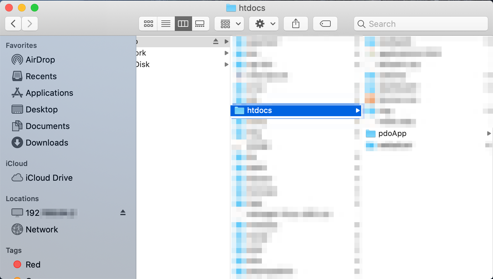
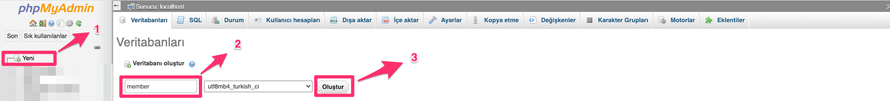
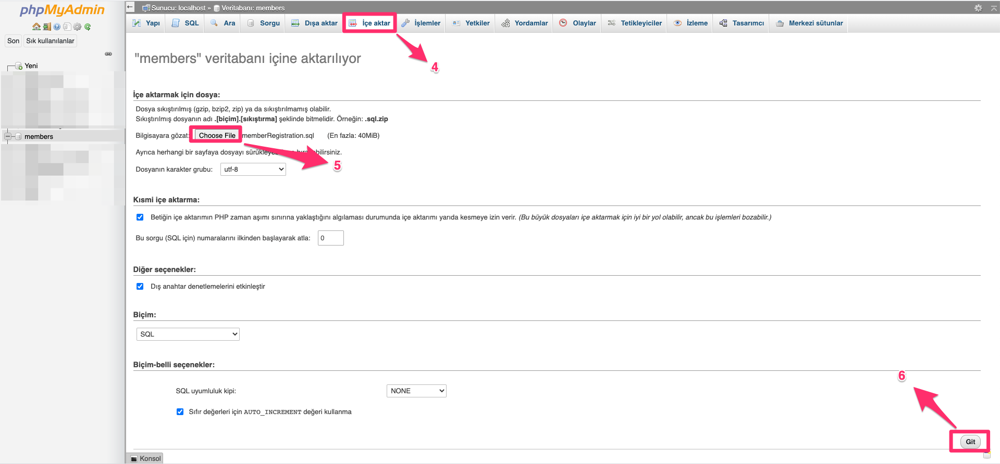

# Member Registration Form with PDO

Member registration form developed with PHP Data Objects.

## How to use ?

1-Download the repo.
2-Run XAMPP.
3-Put the downloaded repo to the "htdocs" directory.
4-Transfer the SQL file to the local database.

## Example

You can examine the "example" folder for examples.